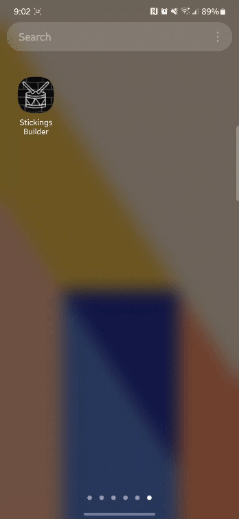

# Stickings Builder

[stickingsbuilder.app](https://stickingsbuilder.app)

  

## About

Stickings Builder is a dynamic tool created for drummers and percussionists who are seeking to improve their technical dexterity through practicing various sticking combinations. Inspired by the legendary drum book 'Stick Control' written by George L. Stone, this application offers a modernized approach to honing drumming skills.

Emphasizing user-friendly design principles, Stickings Builder boasts an interface that is both highly intuitive and interactive. Its layout is optimized for seamless functionality across desktop and mobile devices, ensuring a consistent user experience regardless of platform. This app is also installable and works offline, allowing users to conveniently access their practice routines.

## Tech used / Dependencies

This project is the outcome of my self-directed study in programming and web development. I began by creating a [proof of concept](https://github.com/rokelina/stickings-app) using plain JavaScript before transitioning to React and TypeScript.

- Typescript
- React
- Vite
- Progressive Web App
- Vexflow.js [link](https://github.com/0xfe/vexflow)
- Tone.js [link](https://github.com/Tonejs/Tone.js)
