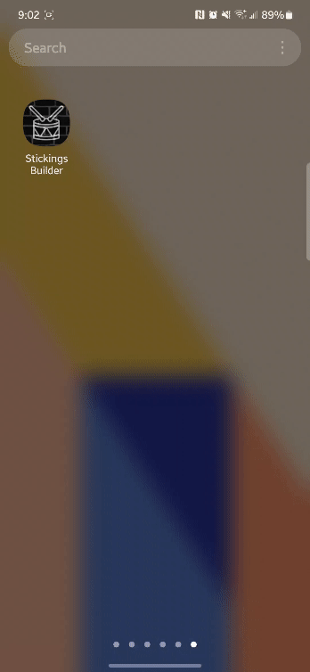

# Stickings Builder

A progressive web app for drummers and percussionists.

**Live:** https://stickingsbuilder.app/

## What it does

A *sticking* is the pattern of which hand plays which note — right, left,
right-right, and so on (the equivalent to fingerings for pianists!). Drummers practice these as isolated exercises.

Stickings Builder generates sticking patterns, renders them as real musical
notation, and plays them back at a tempo you set, so you can hear a pattern
before you try to play it. [Patterns can be saved to your account and picked up
again later.]

## Stack

- **React + TypeScript**, built with Vite
- **VexFlow** for rendering musical notation in the browser
- **Tone.js** for audio playback and timing
- **Firebase Authentication** for accounts, **Firestore** for saved patterns
- Installable **PWA** with offline support
- Continuous deployment on Netlify

## How it got here

It started as a proof of concept in plain JavaScript
([stickings-app](https://github.com/rokelina/stickings-app)). Once the core idea
worked, state management was the thing getting away from me — too many pieces of
UI needed to agree about the same pattern, tempo and playback position. I rebuilt
it in React and TypeScript, which cost a full rewrite but made the state
manageable and allowed for more complex UI interactions.

## Development notes

The `documentation/` directory holds notes and recordings from building this.
I've worked on it solo, so I've kept my own bug log and development journal
throughout — mostly so that six weeks later I could remember why something
was written the way it was. The journal is published at ([link](https://lavish-chopper-a40.notion.site/33c9619d9b5c40fcbc900fe6d8640af2?v=d0c3a559f332484faa618195326e53a6)) and ([link](https://lavish-chopper-a40.notion.site/6bd92d1a9cc049ff965184d86f8b291d?v=6e98933d121b4dbdb9d26f7e9c7b3cb6)) 

## Demo

  

